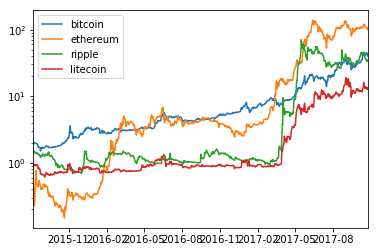
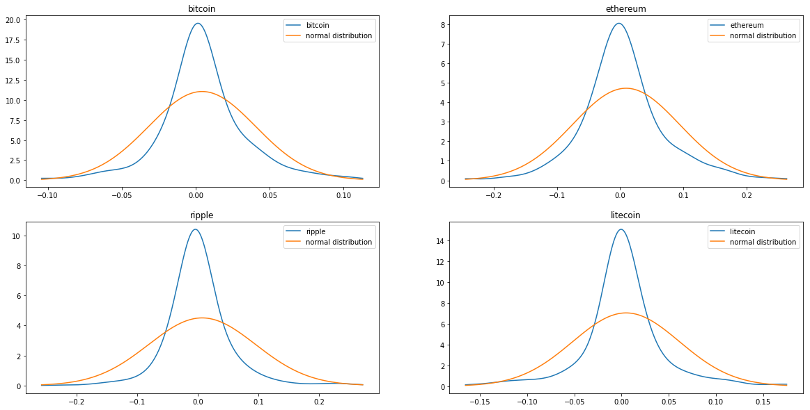

[analyze.ipynb](./analyze.ipynb)

# 暗号通貨間の相関関係の分析

ビットコイン、イーサリアム、リップル、ライトコインの対米ドルの相関関係を調査した。

データは[Cryptocurrency Market Capitalizations](https://coinmarketcap.com/)のデータを使用した。


```python
import requests
from datetime import datetime
import pandas as pd


def fetch_list(coin_type):
    # Cryptocurrency Market Capitalizations (https://coinmarketcap.com/) から拝借
    r = requests.get('https://graphs.coinmarketcap.com/currencies/%s/' % coin_type)
    data = r.json()
    data = data['price_usd'][0:-1]

    arr = []
    first = data[0][1]
    for d in data:
        # コインによって微妙に取得時刻が違うがそのずれは無視して、日付情報にしてしまう。
        date = datetime.fromtimestamp(int(d[0]) / 1000).date()
        value = d[1] / first
        arr.append({"date": date, "value": value})
    result = pd.DataFrame(index=[t["date"] for t in arr])
    result[coin_type] = [t["value"] for t in arr]
    return result

data_frames = []
coins = ["bitcoin", "ethereum", "ripple", "litecoin"]
for coin in coins:
    data_frames.append(fetch_list(coin))

data = pd.concat(data_frames, axis=1, join='inner')
```


```python
data[:1].index[0]
```


    datetime.date(2015, 8, 7)


```python
data[-1:].index[0]
```


    datetime.date(2017, 10, 25)


### 2015/8/7 からの2017/10/21の価格変化

* 全通貨、2015/8/7時点の値を1に揃えている


```python
%matplotlib inline
import warnings
warnings.filterwarnings('ignore')

data.plot()
```


    <matplotlib.axes._subplots.AxesSubplot at 0x11587b470>


* 2017年以前が潰れてしまうので、対数化したグラフも用意した


```python
data.plot(logy=True)
```


    <matplotlib.axes._subplots.AxesSubplot at 0x11587b390>





### 全データによる相関関係

* 2015/8/7 ~ 2017/10/21(現在)


```python
data.corr()
```


<div>
<table border="1" class="dataframe">
  <thead>
    <tr style="text-align: right;">
      <th></th>
      <th>bitcoin</th>
      <th>ethereum</th>
      <th>ripple</th>
      <th>litecoin</th>
    </tr>
  </thead>
  <tbody>
    <tr>
      <th>bitcoin</th>
      <td>1.000000</td>
      <td>0.939119</td>
      <td>0.843152</td>
      <td>0.950693</td>
    </tr>
    <tr>
      <th>ethereum</th>
      <td>0.939119</td>
      <td>1.000000</td>
      <td>0.918414</td>
      <td>0.961601</td>
    </tr>
    <tr>
      <th>ripple</th>
      <td>0.843152</td>
      <td>0.918414</td>
      <td>1.000000</td>
      <td>0.890596</td>
    </tr>
    <tr>
      <th>litecoin</th>
      <td>0.950693</td>
      <td>0.961601</td>
      <td>0.890596</td>
      <td>1.000000</td>
    </tr>
  </tbody>
</table>
</div>


### 1年間の相関関係


```python
# 1年分 (欠損値があるためか、363になっている。)
data[-363:].corr()
```


<div>
<table border="1" class="dataframe">
  <thead>
    <tr style="text-align: right;">
      <th></th>
      <th>bitcoin</th>
      <th>ethereum</th>
      <th>ripple</th>
      <th>litecoin</th>
    </tr>
  </thead>
  <tbody>
    <tr>
      <th>bitcoin</th>
      <td>1.000000</td>
      <td>0.909484</td>
      <td>0.761533</td>
      <td>0.932557</td>
    </tr>
    <tr>
      <th>ethereum</th>
      <td>0.909484</td>
      <td>1.000000</td>
      <td>0.878828</td>
      <td>0.943273</td>
    </tr>
    <tr>
      <th>ripple</th>
      <td>0.761533</td>
      <td>0.878828</td>
      <td>1.000000</td>
      <td>0.838380</td>
    </tr>
    <tr>
      <th>litecoin</th>
      <td>0.932557</td>
      <td>0.943273</td>
      <td>0.838380</td>
      <td>1.000000</td>
    </tr>
  </tbody>
</table>
</div>


### 1ヶ月の相関関係


```python
data[-31:].corr()
```


<div>
<table border="1" class="dataframe">
  <thead>
    <tr style="text-align: right;">
      <th></th>
      <th>bitcoin</th>
      <th>ethereum</th>
      <th>ripple</th>
      <th>litecoin</th>
    </tr>
  </thead>
  <tbody>
    <tr>
      <th>bitcoin</th>
      <td>1.000000</td>
      <td>0.508170</td>
      <td>0.354785</td>
      <td>0.724769</td>
    </tr>
    <tr>
      <th>ethereum</th>
      <td>0.508170</td>
      <td>1.000000</td>
      <td>0.670053</td>
      <td>0.751243</td>
    </tr>
    <tr>
      <th>ripple</th>
      <td>0.354785</td>
      <td>0.670053</td>
      <td>1.000000</td>
      <td>0.296768</td>
    </tr>
    <tr>
      <th>litecoin</th>
      <td>0.724769</td>
      <td>0.751243</td>
      <td>0.296768</td>
      <td>1.000000</td>
    </tr>
  </tbody>
</table>
</div>


### 1週間の相関関係


```python
data[-7:].corr()
```


<div>
<table border="1" class="dataframe">
  <thead>
    <tr style="text-align: right;">
      <th></th>
      <th>bitcoin</th>
      <th>ethereum</th>
      <th>ripple</th>
      <th>litecoin</th>
    </tr>
  </thead>
  <tbody>
    <tr>
      <th>bitcoin</th>
      <td>1.000000</td>
      <td>-0.057127</td>
      <td>-0.559826</td>
      <td>0.003630</td>
    </tr>
    <tr>
      <th>ethereum</th>
      <td>-0.057127</td>
      <td>1.000000</td>
      <td>0.559544</td>
      <td>0.567703</td>
    </tr>
    <tr>
      <th>ripple</th>
      <td>-0.559826</td>
      <td>0.559544</td>
      <td>1.000000</td>
      <td>0.788812</td>
    </tr>
    <tr>
      <th>litecoin</th>
      <td>0.003630</td>
      <td>0.567703</td>
      <td>0.788812</td>
      <td>1.000000</td>
    </tr>
  </tbody>
</table>
</div>


```python

import scipy
from scipy.stats import gaussian_kde
import matplotlib.mlab as mlab
fig, subplts = plt.subplots(2,2,figsize=(20, 10))
stats = []
names=[]
i = 0
for name, series in data.iteritems():
    ave = series.mean()
    std = np.std(series, ddof=1)
    skew = scipy.stats.skew(series)  # 歪度
    kurtosis = scipy.stats.kurtosis(series)  # 尖度
    stats.append([ave, std, skew,kurtosis])
    ls = np.linspace(-3 * std + ave, 3 * std + ave, 300)
    norm = mlab.normpdf(ls, ave, std)
    kde = gaussian_kde(series)
    subplot = subplts[int(i/2)][i%2] 
    subplot.set_title(name)
    subplot.plot(ls, kde(ls), label=name)
    subplot.plot(ls, norm, label='normal distribution')
    subplot.legend()
    names.append(name)
    i += 1
print('図3  推定確率密度関数')
```

    図3  推定確率密度関数





```python
print('表1   各種モーメント')
pd.DataFrame(stats, index=names, columns=['平均','標準偏差','歪度','尖度'])
```

    表1   各種モーメント


<div>
<table border="1" class="dataframe">
  <thead>
    <tr style="text-align: right;">
      <th></th>
      <th>平均</th>
      <th>標準偏差</th>
      <th>歪度</th>
      <th>尖度</th>
    </tr>
  </thead>
  <tbody>
    <tr>
      <th>bitcoin</th>
      <td>8.824570</td>
      <td>9.330985</td>
      <td>1.882888</td>
      <td>2.722521</td>
    </tr>
    <tr>
      <th>ethereum</th>
      <td>22.824129</td>
      <td>38.454255</td>
      <td>1.662061</td>
      <td>1.118623</td>
    </tr>
    <tr>
      <th>ripple</th>
      <td>9.243208</td>
      <td>15.655310</td>
      <td>1.660447</td>
      <td>1.265850</td>
    </tr>
    <tr>
      <th>litecoin</th>
      <td>3.022372</td>
      <td>4.215165</td>
      <td>1.758127</td>
      <td>1.756267</td>
    </tr>
  </tbody>
</table>
</div>


