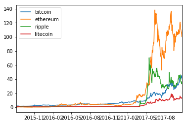

[analyze.ipynb](./analyze.ipynb)

# 暗号通貨間の相関関係の分析

ビットコイン、イーサリアム、リップル、ライトコインの対米ドルの相関関係を調査した。

データは[Cryptocurrency Market Capitalizations](https://coinmarketcap.com/)のデータを使用した。


```python
import requests
from datetime import datetime
import pandas as pd


def fetch_list(coin_type):
    # Cryptocurrency Market Capitalizations (https://coinmarketcap.com/) から拝借
    r = requests.get('https://graphs.coinmarketcap.com/currencies/%s/' % coin_type)
    data = r.json()
    data = data['price_usd'][0:-1]

    arr = []
    first = data[0][1]
    for d in data:
        # コインによって微妙に取得時刻が違うがそのずれは無視して、日付情報にしてしまう。
        date = datetime.fromtimestamp(int(d[0]) / 1000).date()
        value = d[1] / first
        arr.append({"date": date, "value": value})
    result = pd.DataFrame(index=[t["date"] for t in arr])
    result[coin_type] = [t["value"] for t in arr]
    return result

data_frames = []
coins = ["bitcoin", "ethereum", "ripple", "litecoin"]
for coin in coins:
    data_frames.append(fetch_list(coin))

data = pd.concat(data_frames, axis=1, join='inner')
```


```python
data[:1].index[0]
```


    datetime.date(2015, 8, 7)


```python
data[-1:].index[0]
```


    datetime.date(2017, 10, 21)


### 2015/8/7 からの2017/10/21の価格変化

* 全通貨、2015/8/7時点の値を1に揃えている


```python
%matplotlib inline
import warnings
warnings.filterwarnings('ignore')

data.plot()
```


    <matplotlib.axes._subplots.AxesSubplot at 0x10a6efa58>





* 2017年以前が潰れてしまうので、対数化したグラフも用意した


```python
data.plot(logy=True)
```


    <matplotlib.axes._subplots.AxesSubplot at 0x10ac81b70>


### 全データによる相関関係

* 2015/8/7 ~ 2017/10/21(現在)


```python
data.corr()
```


<div>
<table border="1" class="dataframe">
  <thead>
    <tr style="text-align: right;">
      <th></th>
      <th>bitcoin</th>
      <th>ethereum</th>
      <th>ripple</th>
      <th>litecoin</th>
    </tr>
  </thead>
  <tbody>
    <tr>
      <th>bitcoin</th>
      <td>1.000000</td>
      <td>0.942633</td>
      <td>0.847594</td>
      <td>0.952555</td>
    </tr>
    <tr>
      <th>ethereum</th>
      <td>0.942633</td>
      <td>1.000000</td>
      <td>0.917577</td>
      <td>0.960823</td>
    </tr>
    <tr>
      <th>ripple</th>
      <td>0.847594</td>
      <td>0.917577</td>
      <td>1.000000</td>
      <td>0.889792</td>
    </tr>
    <tr>
      <th>litecoin</th>
      <td>0.952555</td>
      <td>0.960823</td>
      <td>0.889792</td>
      <td>1.000000</td>
    </tr>
  </tbody>
</table>
</div>


### 1年間の相関関係


```python
# 1年分 (欠損値があるためか、363になっている。)
data[-363:].corr()
```


<div>
<table border="1" class="dataframe">
  <thead>
    <tr style="text-align: right;">
      <th></th>
      <th>bitcoin</th>
      <th>ethereum</th>
      <th>ripple</th>
      <th>litecoin</th>
    </tr>
  </thead>
  <tbody>
    <tr>
      <th>bitcoin</th>
      <td>1.000000</td>
      <td>0.917400</td>
      <td>0.772459</td>
      <td>0.937823</td>
    </tr>
    <tr>
      <th>ethereum</th>
      <td>0.917400</td>
      <td>1.000000</td>
      <td>0.879420</td>
      <td>0.942978</td>
    </tr>
    <tr>
      <th>ripple</th>
      <td>0.772459</td>
      <td>0.879420</td>
      <td>1.000000</td>
      <td>0.839592</td>
    </tr>
    <tr>
      <th>litecoin</th>
      <td>0.937823</td>
      <td>0.942978</td>
      <td>0.839592</td>
      <td>1.000000</td>
    </tr>
  </tbody>
</table>
</div>


### 1ヶ月の相関関係


```python
data[-31:].corr()
```


<div>
<table border="1" class="dataframe">
  <thead>
    <tr style="text-align: right;">
      <th></th>
      <th>bitcoin</th>
      <th>ethereum</th>
      <th>ripple</th>
      <th>litecoin</th>
    </tr>
  </thead>
  <tbody>
    <tr>
      <th>bitcoin</th>
      <td>1.000000</td>
      <td>0.790301</td>
      <td>0.666455</td>
      <td>0.818199</td>
    </tr>
    <tr>
      <th>ethereum</th>
      <td>0.790301</td>
      <td>1.000000</td>
      <td>0.746798</td>
      <td>0.839676</td>
    </tr>
    <tr>
      <th>ripple</th>
      <td>0.666455</td>
      <td>0.746798</td>
      <td>1.000000</td>
      <td>0.482839</td>
    </tr>
    <tr>
      <th>litecoin</th>
      <td>0.818199</td>
      <td>0.839676</td>
      <td>0.482839</td>
      <td>1.000000</td>
    </tr>
  </tbody>
</table>
</div>


### 1週間の相関関係


```python
data[-7:].corr()
```


<div>
<table border="1" class="dataframe">
  <thead>
    <tr style="text-align: right;">
      <th></th>
      <th>bitcoin</th>
      <th>ethereum</th>
      <th>ripple</th>
      <th>litecoin</th>
    </tr>
  </thead>
  <tbody>
    <tr>
      <th>bitcoin</th>
      <td>1.000000</td>
      <td>-0.131234</td>
      <td>-0.172297</td>
      <td>0.285506</td>
    </tr>
    <tr>
      <th>ethereum</th>
      <td>-0.131234</td>
      <td>1.000000</td>
      <td>0.956172</td>
      <td>0.846885</td>
    </tr>
    <tr>
      <th>ripple</th>
      <td>-0.172297</td>
      <td>0.956172</td>
      <td>1.000000</td>
      <td>0.711294</td>
    </tr>
    <tr>
      <th>litecoin</th>
      <td>0.285506</td>
      <td>0.846885</td>
      <td>0.711294</td>
      <td>1.000000</td>
    </tr>
  </tbody>
</table>
</div>


